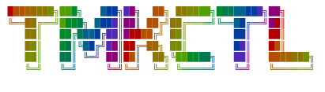

# tmkctl




**tmkctl** is a small web app for running oral exams for *Teorie masové komunikace / Teorie masové kultury*. It helps examiners keep a shared list of students, move students through the exam queue, see exam questions, write notes, and export the results after the exam.

The app is intentionally simple: it is written in PHP, stores exam-day data in MySQL or MariaDB, and works on ordinary shared web hosting. It does not require a JavaScript build step, Node.js, Docker, or a cloud AI service.

## Who It Is For

tmkctl is meant for examiners or course administrators who need one shared dashboard during an oral exam. Several people can open the same exam workspace and see the same queue, preparation slot, active examination, notes, and exports.

It is not a public student portal. Access is protected by one shared password for the exam team.

## Main Features

- Shared-password login with PHP sessions.
- Workspace selection for separate exam terms or exam rooms.
- Manual student entry, CSV import, and paste import from IS MU exam-term pages.
- Exam stack with waiting, preparation, examination, and done states.
- Question display from `data/questions.reviewed.json`.
- Examiner notes with autosave.
- Markdown, TXT, CSV, JSON, and ZIP exports.
- Question-pack validation, upload, and merge tools.
- Basic CSRF protection for state-changing actions.
- Installer for MySQL/MariaDB tables.

Not included in the current MVP:

- AI chat inside the dashboard.
- Hugging Face integration.
- Embeddings or vector database search.
- Per-user accounts or role management.

## Project Layout

```text
app/        PHP application code and configuration loader
data/       question pack, sample data, and development text files
docs/       deployment notes and project documentation
public/     web root; point the website here when possible
public/api/ JSON and download endpoints
sql/        database schema and database notes
tools/      optional local helper tools for question packs and imports
materials/  optional local source materials for offline question generation
```

## Requirements

- PHP 8 or newer.
- MySQL or MariaDB.
- PHP PDO MySQL extension, for example `php8.2-mysql` on Debian/Ubuntu.
- Optional: PHP `ZipArchive` extension for ZIP exports. Without it, the app still exports JSON.
- Optional: Python 3 for local question-pack helper tools. The web app itself does not need Python.

## Quick Local Setup

Create a database:

```sql
CREATE DATABASE tmkctl CHARACTER SET utf8mb4 COLLATE utf8mb4_unicode_ci;
CREATE USER 'tmkctl'@'localhost' IDENTIFIED BY 'tmkctl_dev_password';
GRANT ALL PRIVILEGES ON tmkctl.* TO 'tmkctl'@'localhost';
FLUSH PRIVILEGES;
```

Create local configuration:

```sh
cp app/config.example.php app/config.local.php
```

For the database above, set these values in `app/config.local.php`:

```php
'db_host' => '127.0.0.1',
'db_port' => '3306',
'db_name' => 'tmkctl',
'db_user' => 'tmkctl',
'db_pass' => 'tmkctl_dev_password',
'db_charset' => 'utf8mb4',
'install_enabled' => true,
'debug' => true,
```

The example config uses this development login password:

```text
tmkctl
```

Start the local PHP server:

```sh
php -S localhost:8000 -t public
```

Open the installer:

```text
http://localhost:8000/install.php
```

Then log in:

```text
http://localhost:8000/login.php
```

After successful installation, `install.php` attempts to set these values automatically in `app/config.local.php`:

```php
'install_enabled' => false,
'debug' => false,
```

If that automatic update fails because the file is missing or not writable, set both values manually.

## Configuration

Committed files:

- `app/config.php` loads defaults and optional local overrides.
- `app/config.example.php` documents the expected configuration keys.

Private file:

- `app/config.local.php` stores local or production credentials and the login password hash.

Do not commit `app/config.local.php`.

For production, generate a real shared password hash:

```sh
php -r "echo password_hash('your-shared-password', PASSWORD_DEFAULT), PHP_EOL;"
```

Paste the hash into the password hash keys in `app/config.local.php`, replacing the development password.

## Deployment

Preferred deployment:

- Configure the hosting web root to `public/`.
- Keep `app/`, `data/`, `docs/`, `sql/`, `tools/`, and `materials/` outside direct public web access.

If shared hosting requires uploading everything into one public directory, keep the included `.htaccess` files. They deny direct access to non-public folders on Apache-compatible hosting.

Basic production flow:

1. Create a MySQL or MariaDB database and user in the hosting control panel.
2. Copy `app/config.example.php` to `app/config.local.php`.
3. Fill in production database credentials.
4. Generate and paste a real shared password hash.
5. Set `install_enabled => true`.
6. Upload the files.
7. Open `public/install.php` through the browser.
8. Confirm that installer access and debug mode were disabled automatically, or set both to `false` manually.
9. Log in and import students.

Detailed Active24-style deployment notes are in [docs/deployment-active24.md](docs/deployment-active24.md).

## Database

The installer and schema create these prefixed tables by default:

- `tmkctl_workspaces`
- `tmkctl_workspace_presence`
- `tmkctl_app_settings`
- `tmkctl_students`
- `tmkctl_exam_stack`
- `tmkctl_exam_notes`

The default table prefix is `tmkctl_`. Change `table_prefix` before installation if you need a different prefix.

Schema file:

```text
sql/schema.sql
```

Questions are not stored in the database. They are loaded from:

```text
data/questions.reviewed.json
```

## Student Import

CSV import requires a `name` column:

```csv
name
```

Optional columns:

```csv
uco,email,study_type
```

Recognized `study_type` values:

- `jednoobor`, `jednooborové`, `jednooborovy`, `1obor`, `single` become `single`.
- `dvouobor`, `dvouoborové`, `dvouoborovy`, `2obor`, `double` become `double`.
- Empty or unknown values become `unknown`.

Sample CSV:

```text
data/students.sample.csv
```

For IS MU import, open the SZZ exam terms page, press `Ctrl+A`, then `Ctrl+C`, and paste the whole page text into **Import z IS MU**. The importer looks for TMK-related exam terms and ignores unrelated thesis-defense blocks.

Study-code mapping defaults to:

- `MSZU01` -> `single`
- `MSZU02` -> `double`

Parser sample:

```text
data/is-mu-paste.sample.txt
```

## Exam-Day Workflow

1. Log in.
2. Create or select a workspace for the exam term.
3. Set the current exam-term label, for example `TMK - 10. 6. 2026`.
4. Import or enter students.
5. Move students through waiting, preparation, examination, and done states.
6. Save notes during the exam.
7. Export notes and exam state after the term.
8. Reset the workspace only after exports are safely stored.

Reset requires the exact confirmation text `RESET`. It deletes students, stack state, notes, and the current selection for the workspace. It does not delete questions, configuration, or the database schema. The exam-term label remains unless **Smazat i název termínu** is checked.

## Question Pack

The dashboard reads questions from:

```text
data/questions.reviewed.json
```

The **OTÁZKY** window can inspect the current pack, validate a replacement JSON file, upload a new pack, and merge multiple JSON files.

Validation checks structure, not academic correctness:

- valid JSON and top-level array
- required fields
- duplicate `id` values
- allowed `review_status` values: `reviewed`, `generated`, `needs_review`
- warnings for empty `source_refs` and items that are not marked `reviewed`

Upload only a human-reviewed question pack for real exams. Before a replacement or merge is written, the app creates a backup in:

```text
data/backups/
```

Manual restore means copying the chosen backup back to `data/questions.reviewed.json` and validating it again in the **OTÁZKY** window.

## Optional Offline Question Tools

The `tools/` directory contains optional Python helpers for preparing draft question packs from local teaching materials. These tools are separate from the web dashboard.

Read more in [docs/offline-question-generator.md](docs/offline-question-generator.md).

## Backups

Before exams or deployments, back up:

- MySQL/MariaDB database dump.
- `data/questions.reviewed.json`.
- `data/backups/` if question packs were changed through the app.
- `app/config.local.php` privately.
- Exported notes, if they are used as exam records.

Example database dump:

```sh
mysqldump -h HOST -u USER -p DATABASE_NAME > tmkctl-backup.sql
```

## Security Notes

- Do not deploy with the example password.
- Do not commit `app/config.local.php`.
- Keep `install_enabled => false` after setup.
- Keep `debug => false` on production.
- Keep database dumps and exported exam records out of public web folders.
- Use HTTPS on production hosting.

## Current Consistency Notes

Recent checks show that the PHP files parse successfully and the IS MU parser sample works. The current question pack is structurally valid, but it still contains warnings: 7 questions are not marked `reviewed`, and one question has empty `source_refs` and `key_terms`. Review those entries before relying on the pack for a final exam.

## License

This project is released under the MIT License. See [LICENSE](LICENSE).
